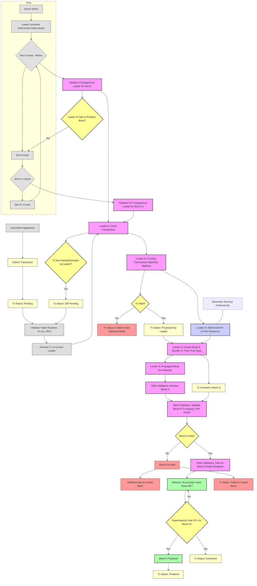

# touching-sol

high-level overview transaction lifecycle, block production, slot progression, PoH, BFT etc

1. **Time Subgraph:** Shows the fundamental structure of Epochs and Slots, and how the Leader Schedule is determined per epoch. It illustrates the continuous progression of slots.
2. **Transaction Origin:** A transaction starts with a user/client and enters a pending state.
3. **Propagation & Leader:** The transaction is sent to a validator (like an RPC node) and forwarded towards the current slot's leader. The diagram shows the leader being assigned based on the schedule for the current slot (N).
4. **Leader Pipeline:** The assigned leader fetches transactions from its pool and puts them through its processing pipeline (SigVerify, Banking).
5. **Tx Validation at Leader:** Transactions are validated. Valid ones proceed; invalid ones lead to a "Failed (Invalid)" status.
6. **Proof of History (PoH):** The leader continuously generates the PoH sequence, incorporating processed transactions and events.
7. **Block Creation:** Valid, processed transactions and the current state of the PoH sequence are bundled into Block N.
8. **Block Propagation:** The leader sends Block N to other validators.
9. **Validation by Others:** Other validators receive Block N and validate its contents, including the transactions and the PoH sequence.
10. **Block Validation Outcome:** If the block is invalid (e.g., contains invalid transactions the leader missed, or a PoH discrepancy), validators ignore it, and transactions within it lead to a "Failed (In Invalid Block)" status. If valid, validators proceed to vote.
11. **Consensus (Tower BFT):** Validators cast stake-weighted votes. The network accumulates these votes.
12. **Confirmation & Finality:** If Block N receives a supermajority (>2/3) of stake votes, it becomes finalized.
13. **Transaction Status Updates:**
    * A transaction included in a block transitions from "Processed" to "Included in Block".
    * If the block is confirmed, the transaction status becomes "Confirmed".
    * If the block is finalized, the transaction status becomes "Finalized".
14. **Alternative Cases:**
    * **Tx Not Included:** A transaction might be valid but not fetched or included by the leader (e.g., arrived too late, network congestion). It remains "Pending" and re-enters the propagation pool to potentially be included by a future leader.
    * **Leader Failure:** If the assigned leader fails, the slot might end without a block from that leader.
    * **Block Invalid:** As mentioned, leads to Tx failure status.
15. **Slot Progression:** The diagram explicitly shows the transition to Slot N+1 and the assignment of the next leader, highlighting that this happens continuously, often before previous blocks are finalized.

## Credits

* dhruvsol / [git](https://github.com/dhruvsol)
* Arpita / [git](https://github.com/ArpitaGanatra)
